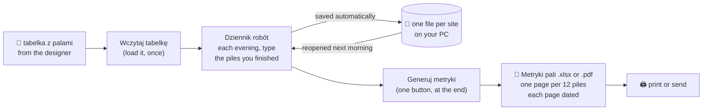
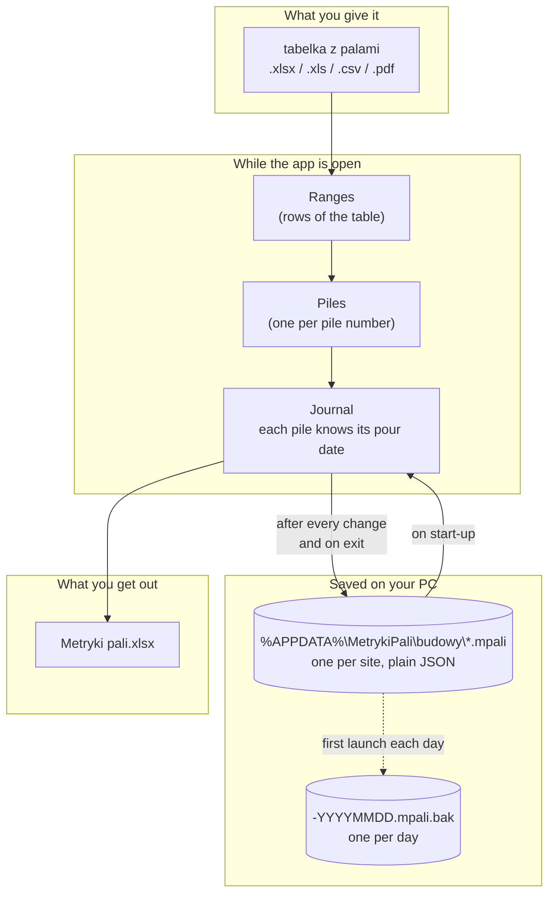
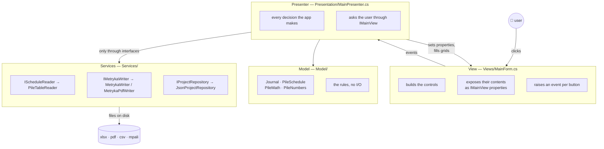

# Metryki pali — generator

Turns a pile schedule (**tabelka z palami**) into printable as-built pile records
(**metryki pali**), grouped by the day each pile was actually poured.

```
tabelka z palami.xlsx   →   [ app ]   →   Metryki pali.xlsx   →   print / PDF
   93 rows of ranges                      81 pages, 12 piles each
```

It is a Windows desktop app. It runs offline, needs no installation, no internet,
no database and no account.

---

## 1. What it does, in plain words

A designer gives you a table that says things like *"piles 1 to 10 are 0.4 m
across and 7 m deep"*. The paperwork you must hand back is completely different:
one sheet per twelve piles, each sheet stamped with the date those twelve piles
were concreted, each pile listed with its length and how much concrete went in.

Typing that by hand for a thousand piles takes days. This app does it in seconds.

The part that cannot be automated is knowing **which piles you did on which
day** — only the person on site knows that. So the app keeps a **work journal**:
every evening you type in the piles you finished, and it remembers. At the end of
the job you press one button and get the whole set of metryki.



You can close the app, shut the computer down, and come back a week later. The
journal is still there.

---

## 2. How to run it

### The easy way — one file, no installation

```powershell
powershell -ExecutionPolicy Bypass -File publish.ps1
```

This produces **`publish\MetrykiPali.exe`** (about 51 MB). Copy that one file
onto any Windows 10 or 11 machine and double-click it. Nothing else is needed —
not even .NET.

### From source — for developers

Requires the .NET 10 SDK. Every routine job has a named task:

```powershell
.\run.ps1            # list the tasks
.\run.ps1 app        # build and start the app
.\run.ps1 test       # run the tests   (.\run.ps1 test --filter Journal)
.\run.ps1 watch      # start it and rebuild whenever a file changes
.\run.ps1 exe        # build the standalone offline .exe
.\run.ps1 check      # build + test + publish — everything required before a merge
.\run.ps1 data       # open the folder holding the saved journal
.\run.ps1 testcopy <folder>   # a copy of the app to try out, on a copy of the journal
.\run.ps1 clean      # delete bin, obj and publish
```

The plain `dotnet build` / `dotnet test` / `dotnet run --project src\MetrykiPali`
work exactly as usual; `run.ps1` is only a set of shortcuts over them.

---

## 3. How to use it

### Step 1 — load the schedule (once per site)

Press **Wczytaj tabelkę...** and pick the file. Accepted: `.xlsx`, `.xls`
(Excel 97-2003), `.csv`, `.pdf`.

**The designer's summary table, as it comes** (`TABELA ZESTAWCZA PALOWANIA`,
`ZESTAWIENIE PALI`, …) is read by its headers, so the column order and the extra
columns (rzędne, łączna długość, masa, …) do not matter. It needs:

| header | read as |
|---|---|
| `NR PALI` / `NUMERY PALI` | `1 - 19`, `1 ÷ 28`, or a single number in either cell |
| `ŚREDNICA` | with its unit from the row below — `[cm]`, `[mm]` or `[m]` |
| `DŁUGOŚĆ 1 PALA` / `DŁUGOŚĆ PALI` | one pile — not `ŁĄCZNA DŁUGOŚĆ`, not the cage's `DŁUGOŚĆ [Lz]` |
| `ZBROJENIE` / `RODZAJ ZBROJENIA` | optional; `-` or blank becomes `Brak`, `Z1` / `IPE160` are kept |

Totals rows and lookup lists below the table are skipped. A table of steel
soldier columns (`NUMERY SŁUPÓW`, IPE sections) has no diameter and is refused
with that reason.

**Or a plain five-column table**, in this order:

| numer od | numer do | średnica [m] | długość pala [m] | zbrojenie |
|---|---|---|---|---|
| 1 | 10 | 0.4 | 7 | Brak |
| 11 | 28 | 0.4 | 8 | Brak |

Title lines, blank rows, notes and totals are skipped automatically. Both `0.4`
and `0,4` are understood.

After loading, the app says if the numbering has gaps (often deliberate — piles
dropped from the design — but worth a look), and refuses a table that gives the
same pile number twice.

The app expands the ranges into individual piles — `1–10` becomes ten piles — and
works out the concrete for each.

### The window

Top bar: the **Budowa** picker (its list ends with **➕ Nowa budowa…**), **Nowa
budowa**, **Więcej** (rename, add from a file, save a copy, data folder) and the
**Jasny | Ciemny** switch — a light and a dark look, remembered on the computer.

Three cards: **DANE BUDOWY** (the header printed on the metryki and the footer
with its logo), **BETON** (how concrete is worked out — the field the chosen
method uses is the one that can be typed in — and the plant), and **TABELKA Z
PALAMI** (the loaded schedule, and two progress bars: piles in the journal, and
concrete — the schedule's pure geometric volume, diameter and design length with
no coefficient, logged against total). Below them the journal with the entry
row, and a bottom bar with the counts, the piles still without a metryka, and
the generate buttons.

### Step 2 — check the header

**Budowa**, **Wykonawca**, **Metoda**, **Betoniarnia** are printed on every page.
They come pre-filled; correct them once and they are remembered.

**Stopka (tekst)** is printed bottom left of every page (the company name by
default). **Obraz w stopce** adds a picture — a logo, a stamp — from a JPG, PNG,
BMP, GIF or TIFF file, printed about 1 cm tall, **po lewej**, **na środku** or
**po prawej**. The picture takes that part of the footer: on the left it moves
the text to the middle, on the right it moves the page number there. It is kept
inside the site's file, so it travels with the site; **Usuń** takes it off.

### Step 3 — log each day's work

This is the part you repeat. Set the date, type the piles, press Enter:

```
Data wykonania: 13.09.2022     Pale: 11-16, 63-66, 77-84
```

Write ranges and single numbers separated by commas, semicolons or spaces —
`1-10, 25, 30-33`. You can also tick rows on the **Pale** tab and press
**Dodaj zaznaczone z listy pali**.

The **Dziennik (dni)** tab then shows one line per day:

| Data | Pale | Ilość | Beton [m³] | Wsp. betonu | Stron | Metryki wygenerowane |
|---|---|---|---|---|---|---|
| 12.09.2022 | 1-10, 17-18 | 12 | 14.02 | 1,30 | 1 | 12.09.2022 |
| 13.09.2022 | 11-16, 63-66, 77-84 | 18 | 24.18 | 1,30 | 2 | nie |

**Metryki wygenerowane** shows when a day's metryki were written: a date,
**nie**, or **częściowo** when piles were added to the day afterwards. A day
also goes back to **nie** when its coefficient is changed, and a pile when its
length or diameter is corrected — the printed figures no longer match.

Bottom left, under the counts, **Pale bez metryk: N — pokaż które** lists
everything still without a metryka, so nothing is missed: the piles with no
date yet, and each day with piles not generated since they last changed.

Close the app whenever you like. Tomorrow it opens exactly as you left it.

If you type a pile you already logged on a different day, the app asks whether
you meant to **move** it — it never ends up on two days at once.

### Step 4 — correct anything that differs from the design

On the **Pale** tab, **Dł. wykonana** starts equal to the design length. If a
pile actually went deeper, type the real figure; its concrete volume recalculates
straight away.

### Step 5 — generate

Pick **Format** next to the buttons — **Excel (.xlsx)** or **PDF (.pdf)**; the
choice is remembered. Then press **Generuj metryki — wszystkie dni** and choose
where to save. Every day in the journal is written in one go. **Otwórz
wygenerowany plik** opens it to check and print.

The workbook opens in Excel's **page break preview** (Podgląd podziału stron) at
70 %, so each printed page — one metryka — is outlined and numbered on screen.

The PDF is drawn page for page like the workbook prints — same layout, Calibri
embedded — so it can be sent as it is, with no Excel needed.

Piles with no date yet are **not** included — the app tells you how many are
still outstanding and asks before continuing.

To hand over one day's metryki without waiting for the end of the job, click
that day on the **Dziennik (dni)** tab and press **Generuj metryki — zaznaczone
dni**. Ctrl-click or Shift-click picks several days; the file is named after the
day (`Metryki pali 2022-09-13.xlsx`) or the span (`… 2022-09-12 do 2022-09-13.xlsx`).

---

## 4. How the data is managed

Everything lives in files on your own computer. Nothing is sent anywhere.



**Sites (budowy)** — every site has its own file, holding its own schedule,
journal and header details. Pick the site from the **Budowa** list at the top of
the window; its last entry, **➕ Nowa budowa...**, adds one (so does the button
beside it). A new site starts with no schedule and no journal, and keeps the
contractor, method, plant and coefficient of the site you were on. The app
reopens the site you were on when you closed it.

**Where the journal is kept**

```
%APPDATA%\MetrykiPali\budowy\<nazwa budowy>.mpali
```

which is usually `C:\Users\<you>\AppData\Roaming\MetrykiPali\budowy\`. Use
**Budowa → Pokaż folder z danymi** to open it.

The first time this version starts, the single `projekt.mpali` kept by earlier
versions is copied in as the first site, named after its **Budowa** field. The
old file is left exactly as it was, as a spare copy.

**What is in it** — plain readable JSON: the site details, the ranges from the
schedule, and every pile with its lengths and its pour date. You can open it in
Notepad. You can copy it to another machine. You can back it up like any file.

**How it is protected**

- Saved after **every** change and again when you close the window — there is no
  "save" button to forget.
- Written to a temporary file first, then moved into place. If the machine dies
  mid-save, the previous journal is still intact rather than half-written.
- One dated backup is kept the first time you open the app each day.
- If the file is ever damaged, the app starts empty instead of refusing to open.

**A separate copy for testing** — if a folder named `dane` sits next to
`MetrykiPali.exe`, that copy of the app keeps its journal there instead of in
`%APPDATA%`, and says so in the window title. Put a copy of `projekt.mpali` (or a `budowy` folder) in it
to try a new version on real data without any risk to the real journal.

**Moving a site between computers** — **Budowa → Zapisz kopię budowy jako...**
writes the open site to a file of your choice; **Budowa → Dodaj budowę z
pliku...** adds such a file to the list on the other machine. **Budowa → Zmień
nazwę budowy...** renames the open one.

**Reloading a corrected schedule keeps the journal.** If the designer reissues
the table, load it again: pour dates are matched back onto the new piles by
number. Weeks of site records are not lost to a re-import.

---

## 5. How the concrete volume is worked out

```
V = π/4 · D² · L · k
```

`k` is the overbreak coefficient — the field **Wsp. betonu**, default **1.30**.
It accounts for concrete filling more than the theoretical bore.

`k = 1.30` reproduces the figures in the reference documentation for a 0.4 m CFA
pile:

| L [m] | 6 | 7 | 8 | 9 | 10 | 11 | 12 |
|---|---|---|---|---|---|---|---|
| computed [m³] | 0.98 | 1.14 | 1.31 | 1.47 | 1.63 | 1.80 | 1.96 |

⚠️ In the real records the ratio drifts between about **1.18 and 1.46** from day
to day, because those are *measured* quantities, not calculated ones. 1.30 is a
sensible default, not ground truth.

**Every day keeps its own coefficient.** A day takes the value in **Wsp. betonu
(nowe dni)** at the moment its first piles are logged, and keeps it: changing the
field afterwards only affects days logged from then on (and piles with no date
yet), so metryki already handed over are never silently rewritten. To correct one
day, double-click its **Wsp. betonu (edytuj)** cell on the **Dziennik (dni)** tab
— that day's volumes recalculate, the others stay as they were. The **Pale** tab
shows which coefficient each pile was computed with.

**Or from the concrete actually used.** Set **Beton liczony** to **z ilości
zużytej w dniu** and a day's concrete comes from the figure on the delivery
notes instead: type it in the box under the pile numbers when logging the day
(or later, in the day's **Zużyto [m³]** cell in the journal). It is shared among
that day's piles in proportion to their theoretical volume (diameter² ×
length), to two decimals, and the shares add up to the figure exactly — the
cents that plain rounding would lose go to the piles that were rounded down
the most. The **Wsp. betonu** column then shows what the figure amounts to
(used ÷ theoretical), a quick check it is sensible; below 1.0 or above 2.5 the
app asks before taking it. Piles added to, moved off or corrected on such a
day share the same total again. Clearing the cell, or typing a coefficient,
takes the day back to the coefficient. Days on either method can sit side by
side in one site.

Projects saved by earlier versions open with every logged day pinned to the
single coefficient they were saved with, so no volume changes on opening.

---

## 6. How the code is organised

The app follows **MVP (Model–View–Presenter)**, the standard arrangement for
Windows Forms — the desktop equivalent of MVC on the web, and the sibling of MVVM
in WPF. It is used here in its **Passive View** form: the window contains no
decisions at all.



**Why it is worth the extra files**

| Layer | Knows about | Can be tested without |
|---|---|---|
| **View** (`MainForm`) | buttons, grids, dialogs | — it is the only part not unit-tested |
| **Presenter** (`MainPresenter`) | what should happen when | a window, a disk |
| **Model** (`Journal`, `PileMath`, …) | pile rules and arithmetic | anything at all |
| **Services** | files, Excel, JSON | — the real ones are tested against fixtures |

The presenter never mentions a `Button`, a `MessageBox` or a file path it made up
itself; it asks `IMainView`. That single rule is what lets the test suite press
every button in the app and read every message back without a window ever
opening — see `MainPresenterTests` and `Fakes.cs`.

`Program.cs` is the **composition root**: the one place that decides which real
implementations get used. The tests substitute fakes there and nothing else
changes.

The domain is deliberately small and pure. `Journal` is the heart of it: it owns
the rule that a pile's pour date lives on the pile itself, so there is never a
second list to fall out of step. It also splits "what would happen" (`Plan`) from
"do it" (`Apply`), which is why the app can ask *"these piles already have a
different date — move them?"* before anything changes.

### Project layout

```
src/MetrykiPali/
  Program.cs                  composition root — wires everything together
  Model/
    Types.cs                  Pile, PileRange, WorkDay, MetrykaSettings, ProjectState
    Journal.cs                which piles were poured on which day
    PileMath.cs               the volume formula + expanding ranges into piles
    PileNumbers.cs            parses and formats "1-10, 25, 30-33"
  Services/
    Interfaces.cs             IScheduleReader, IMetrykaWriter, IProjectRepository
    PileTableReader.cs        reads .xlsx / .xls / .csv / .pdf
    DesignerTable.cs          reads a designer's summary table by its headers
    LegacyExcel.cs            opens old .xls workbooks
    MetrykaWriter.cs          writes the paginated METRYKA PALI workbook
    MetrykaPdfWriter.cs       writes the same pages straight to PDF
    MetrykaFileWriter.cs      picks the writer from the file extension
    FooterImage.cs            turns the chosen footer picture into a small PNG
    ExcelFooterPicture.cs     puts that picture into the workbook's printed footer
    JsonProjectRepository.cs  saves and restores the journal
  Presentation/
    IMainView.cs              what the presenter may ask the window for
    MainPresenter.cs          all of the behaviour
  Views/
    MainForm.cs               the window — controls and events only
    Ui.cs, Theme.cs           the window's own controls and its light and dark colours
tests/MetrykiPali.Tests/
  fixtures/                   sample schedules in every supported format
publish.ps1                   builds the standalone offline .exe
```

---

## 7. Tests

```powershell
dotnet test
```

**278 tests** on xUnit v3, a few seconds, no window and no network.

| Suite | What it covers |
|---|---|
| `MainPresenterTests` | the whole app driven through a fake window: loading, logging days, moving piles, generating, saving, every error path |
| `JournalTests` | plan-then-apply, moving a pile between days, removing a day, per-day totals |
| `PileNumbersTests` | `1-10, 25, 30-33`, mixed separators, en/em dashes, dedup, round-trip; junk rejected with the bad fragment named |
| `PileMathTests` | the formula, every length in the reference table, half-away-from-zero rounding |
| `PileTableReaderTests` | csv/xlsx/pdf, comma *and* dot decimals, junk skipped, a file locked by Excel, unsupported types |
| `DesignerTableTests` | designers' summary tables in three real layouts (.xls and .xlsx): `-` / `÷`, single piles, cm, cage columns, totals; steel soldier columns refused; gaps and duplicate numbers |
| `JournalToolsTests` | which piles lack a metryka (undated, never generated, changed since), footer text and picture in the workbook (VML shape in the chosen section) and in the PDF |
| `MeasuredConcreteTests` | a day's concrete from what was used: shares by volume that add up to the cent, re-sharing when piles are added, moved or corrected, back to the coefficient, the sanity question, mixing both methods, restart and reload |
| `PaginationTests` | days never share a page, an 18-pile day splits 12 + 6, date ordering |
| `MetrykaWriterTests` | the produced workbook read back: label rows, 48-row blocks, per-page dates, page breaks, A4 fit-to-width, borders, an 80-page run |
| `MetrykaPdfWriterTests` | the PDF read back: pages per day, dates, title and table text, Polish characters, page numbers, A4; `.pdf` vs `.xlsx` routing |
| `ProjectStoreTests` | round-trip, pour dates and corrected lengths, Polish characters, missing/corrupt files, daily backup; sites listed in Polish order, renamed, last one remembered; safe site names |
| `WorkflowTests` | three site days across two restarts, then one generation |
| `RobustnessTests` | awkward inputs found by probing: `.xls` and corrupt workbooks, a schedule behind a cover sheet, split PDF rows, pour dates across timezones |

Test inputs are in [tests/MetrykiPali.Tests/fixtures/](tests/MetrykiPali.Tests/fixtures/)
and double as sample files to try the app with:

| File | Shape |
|---|---|
| `tabelka-testowa.xlsx` | 6 ranges / 60 piles, the normal case |
| `tabelka-testowa.pdf` | the same table as a PDF |
| `tabelka-podstawowa.csv` | semicolons, dot decimals, a 7.5 m length |
| `tabelka-przecinki.csv` | semicolons with **comma** decimals |
| `tabelka-angielska.csv` | commas as field separators |
| `tabelka-smieci.csv` | title lines, blank row, a note and a totals row to ignore |
| `zestawienie-myslniki.xls` | designer's table: `1 - 12`, single pile in the middle cell, Ø in cm, `-` for no cage, a gap at 21 |
| `zestawienie-daszki.xls` | designer's table: `1 ÷ 10`, Z1 / Z2 / IPE220, cage columns and a SUMA row |
| `zestawienie-kolejnosc.xlsx` | designer's table with the columns in another order, IPE160 on one pile |
| `zestawienie-slupy.xls` | steel soldier columns — refused |

Two real bugs were found by writing these: CSV files with comma decimals were
silently dropping every row, and starting a new project overwrote the file the
current site had just been saved to.

---

## 8. Sample output

[przyklad/](przyklad/) holds results generated from the real Łódź schedule:

- `Metryki pali - WYGENEROWANE.xlsx` / `.pdf` — all 969 piles, 81 pages
- `Metryki pali - dziennik 2 dni (z aplikacji).xlsx` — two logged days, produced
  through the app's own interface

---

## 9. Working on the code

Each feature gets its own branch, merged back with `--no-ff` so the history shows
what changed for which reason. Branch names, commit style and the checks to run
before merging are in **[CONTRIBUTING.md](CONTRIBUTING.md)**.

```bash
git log --graph --oneline --decorate --all     # what has changed, feature by feature
```

---

## 10. Known limits

- The source table's five columns must be in the order shown; there is no column
  mapping screen yet.
- **Beton z betoniarni** is one value for the whole job, not per day.
- Generating blocks the window for a second or two on a large job; there is no
  progress bar.
- The journal records *which* piles were poured on a day, not the order within it.
